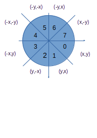

Implementing drawing algorithms
===============================

Description
-----------

This repository shows the implementation of algorithms for drawing lines, circles and ellipses
on a bitmap device like a LCD display. It can be adapted to drive devices like CNC equipment.

Introduction
------------

It is common the need to draw a figure on a screen. The most common figures are lines, circles and ellipses. Other figures includes the different forms of Bezier curves. 

The direct form uses floating point variables and operations and generally, trigonometric functions. But it is possible to use only integer variables and operations. 

The most used algorithms are:

1. Bresenham
2. Midpoint

The screen can be considered as a matrix with N rows and M columns. Generally the top left point is (0,0) and the bottom right point is (N-1,M-1).

The implementation presents small differences according the octants as shown below.

<table>
<tr><th>Quadrant</th><th>x</th><th>y</th><th>Octant</th><th></th></tr>
<tr><td rowspan=2>0</td><td rowspan=2>x > 0</td><td rowspan=2>y > 0 </td><td>0</td><td>|x| > |y|</td></tr>
<tr><td>1</td><td>|x| < |y|</td></tr>
<tr><td rowspan=2>1</td><td rowspan=2>x < 0</td><td rowspan=2>y > 0 </td><td>2</td><td>|x| < |y|</td></tr>
<tr><td>3</td><td>|x| > |y|</td></tr>
<tr><td rowspan=2>2</td><td rowspan=2>x < 0</td><td rowspan=2>y < 0 </td><td>4</td><td>|x| > |y|</td></tr>
<tr><td>5</td><td>|x| < |y|</td></tr>
<tr><td rowspan=2>3</td><td rowspan=2>x > 0</td><td rowspan=2>y < 0 </td><td>6</td><td>|x| < |y|</td></tr>
<tr><td>7</td><td>|x| > |y|</td></tr>
</table>

To get better rasterizations of curves, a technique called antialising can be used. It uses more than one pixel for a curve point, each of them with different intensity values.

Lines
-----

*TBD!!!*

Circles
-------

It is possible to use *TBD*

Since the circle has many simmetries, generally, the algorithms work on one octant, usually, Octant 0.

The first simmetry is around the x axis, So, by changing the negative sign of y, one need only to consider the semi plane with positive values of y, that is, Quadrants Q0 and Q1.

The second simmetry is around the y axis. So, by changing the negative sign of x, one need only to consider the Quadrant Q0.

Finally, there is a simmetry around a bisecting line at 45 degrees. This is the same line that divides the quadrant in two octants. The octant 2 can be mapped into 1, by swapping x and y.

Ellipses
--------

*TBD!!!*

References
----------

1. [Bresenham](http://www.research.ibm.com/journal/sj/041/ibmsjIVRIC.pdf)
2. [The Beauty of Bresenham's Algorithm](http://members.chello.at/~easyfilter/bresenham.html)
3. [A Rasterizing Algorithm for Drawing Curves](http://members.chello.at/%7Eeasyfilter/Bresenham.pdf)
